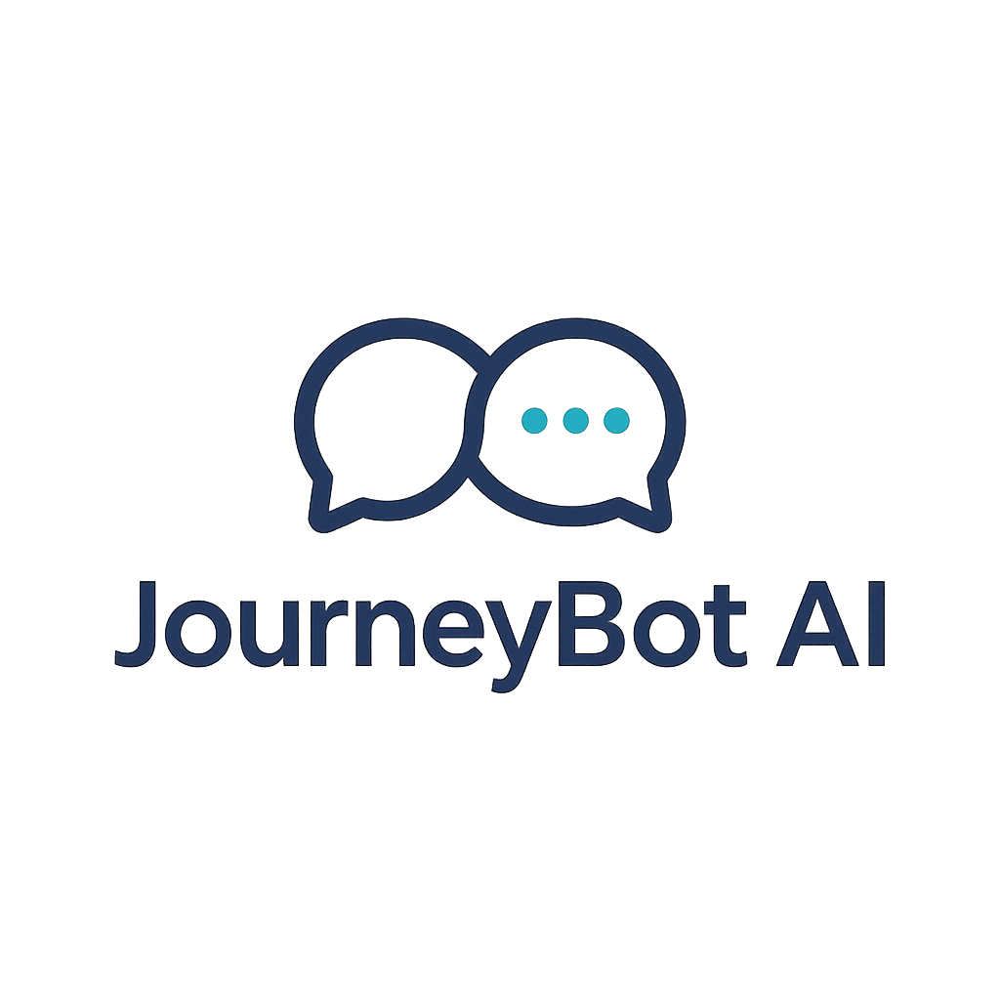

  

<h2 align="center">
AI-Powered Lead Nurturing for Travel Agencies
</h2>

# 🚀 Building JourneyBot in Public

JourneyBot is an AI-powered lead nurturing platform for travel agencies.

The goal is to help travel businesses engage with customers faster through WhatsApp by automating lead qualification, customer communication, follow-ups, payments, invoicing, and tour updates.

This repository does **not** contain the JourneyBot source code.

Instead, it serves as a public engineering journal documenting the journey of designing, building, and scaling the product.

---

# Why Build in Public?

I started JourneyBot for two reasons:

1. To solve a real business problem for travel agencies.
2. To learn how modern software systems are designed, built, and scaled.

Over the coming months, I'll be documenting both successes and failures while exploring topics such as:

* System Design
* Software Architecture
* Event-Driven Systems
* Distributed Systems
* AI Agents
* Conversational AI
* Scalability
* Observability
* Product Thinking
* SaaS Development

The objective is not to showcase perfect solutions.

The objective is to document the learning process and engineering decisions along the way.

---

# Project Status

🟢 In Development

Started: June 2026

Current Focus:

* Defining MVP scope
* WhatsApp integration
* Initial backend API
* Architecture exploration

---

# Current Architecture Decisions

The project intentionally starts with minimal assumptions.

Technology choices will be driven by requirements, constraints, and trade-offs discovered during development.

## Decisions Made

* JourneyBot will be built in public.
* Source code will remain private.
* WhatsApp will be the primary customer interaction channel.
* Development will start using .NET.
* The project will begin as a single deployable application(monolith).
* Significant technical decisions will be documented as ADRs.

## Decisions Under Evaluation

* Database selection
* Data storage strategy
* Authentication and authorization approach
* AI model providers
* Messaging infrastructure
* Hosting platform
* Monitoring and observability tools
* Service decomposition strategy

Future decisions will be recorded as Architecture Decision Records (ADRs) together with their rationale and trade-offs.

---

# 📝 Architecture Decision Records (ADRs)

Architecture Decision Records document important technical decisions and the reasoning behind them.

| ADR     | Title                                       | Status   |
| ------- | ------------------------------------------- | -------- |
| ADR-001 | Build JourneyBot in Public                  | Accepted |
| ADR-002 | Keep Source Code Private                    | Accepted |
| ADR-003 | Use WhatsApp as Primary Interaction Channel | Accepted |
| ADR-004 | Start Development Using .NET                | Accepted |

View all ADRs in the `/adrs` directory.

---

# 📚 Lessons Learned

Key lessons gathered throughout the journey.

| Date        | Lesson |
| ----------- | ------ |
| Coming Soon | —      |

---

# 🛠 Roadmap

## Phase 1 — MVP

* [ ] Receive WhatsApp messages
* [ ] Process incoming conversations
* [ ] Store conversation history
* [ ] Basic automated responses

## Phase 2 — Lead Qualification

* [ ] Lead capture workflow
* [ ] Customer information collection
* [ ] Intent identification
* [ ] Human handoff process

## Phase 3 — Business Workflows

* [ ] Follow-up automation
* [ ] Payment workflows
* [ ] Invoice generation
* [ ] Tour notifications

## Phase 4 — Scaling & Reliability

* [ ] Evaluate messaging patterns
* [ ] Evaluate service boundaries
* [ ] Improve observability
* [ ] Performance optimization

---

# 🔗 Build in Public Posts

## LinkedIn

| Week | Topic | Link |
|------|--------|------|
| Week 1 | Why I'm Building JourneyBot | [View Post](https://www.linkedin.com/posts/mayur-kolekar_buildinginpublic-ai-dotnet-share-7470531356670947331-0whj/) |

---

# About Me

I'm a Senior Software Engineer with experience building enterprise SaaS products, backend systems, AI-powered applications, and monolith systems.

This repository is a public record of my journey to become a better engineer by building real products and documenting the decisions behind them.

If you're interested in software architecture, AI systems, SaaS products, or building in public, feel free to follow along.

Linkedin: https://www.linkedin.com/in/mayur-kolekar/ X: @5_mayurkolekar
